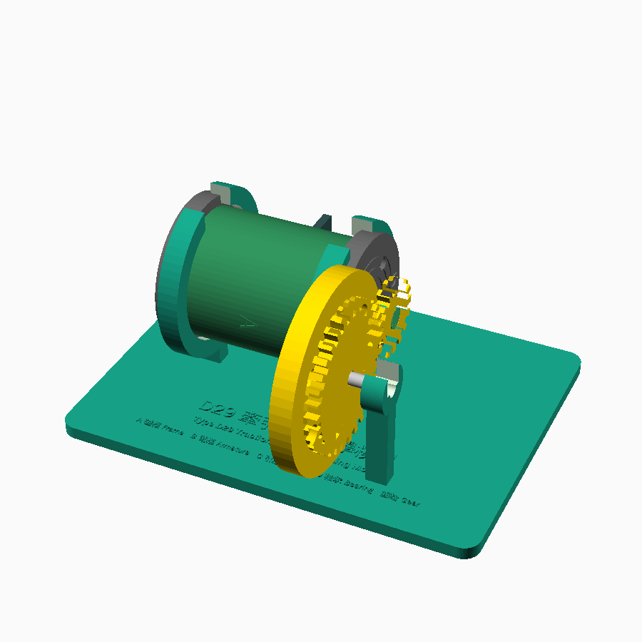
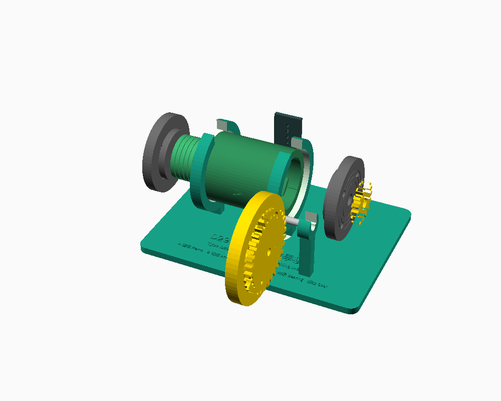

# D29 牽引馬達教學模型 — 3D-Printable Traction Motor Teaching Aid

A parametric, 3D-printable working model inspired by the "Type D29 Traction
Motor" (D29型牽引馬達) exhibit panel: an exploded diagram of a rail traction
motor labelled **A 磁框 Electromagnet Frame**, **B 電樞 Armature**,
**C 引線 Cables**, **D 軸承 Bearing**, plus the **齒輪 Gear** that drives the
wheels. This model reproduces the same five callouts as physical parts that
snap/bolt together, so students can assemble, disassemble, and turn the
armature to see the gear drive turn a display wheel — the same story the
panel tells in text:

> "Traction motors ... convert electric power into mechanical power, and
> drive the wheels forward or backward through a gear drive."

All parts are parametric OpenSCAD (`.scad`), open in the free
[OpenSCAD](https://openscad.org/) app and exported to `.stl` for slicing.

| Assembled | Exploded (matches the panel's diagram style) |
|---|---|
|  |  |

## Part list (matches the panel's callouts)

| Callout | Chinese | English | What it is here | Real motor's function |
|---|---|---|---|---|
| A | 磁框 | Electromagnet Frame | A hollow tube with 4 inward pole ribs, a cut-away viewing window, and bolt bosses for the bearing end caps | Houses the field-coil poles that generate the magnetic field |
| B | 電樞 | Armature | A shaft with a grooved "laminated" core, a slotted commutator ring, and a D-flat drive end | The rotating part; current in its windings reacts with the field to spin it |
| C | 引線 | Cables | A small cover with 4 grommet holes that clips over the frame's window | Carries current into the field coils and, via the commutator, into the armature |
| D | 軸承 | Bearing | Two end caps that bolt to the frame and support the shaft, with decorative raceway grooves | Supports the armature shaft and keeps it turning true |
| — | 齒輪 | Gear | A pinion on the armature's drive end meshing with a larger gear/wheel on a separate axle | Steps the armature's rotation down and drives the wheels |

A base stand (`base_stand`) cradles the assembled motor and carries the
wheel axle so the gears mesh automatically, plus a nameplate engraved with
the same bilingual legend as the exhibit panel.

## Files

```
3d_teaching_aid/
├── scad/
│   ├── common.scad          shared parameters (every dimension lives here)
│   ├── parts.scad           all part + stand modules
│   ├── assembly_fitted.scad preview: everything mounted together
│   ├── print_*.scad         one file per part, oriented for printing
├── stl/                     exported STL files (one per part)
└── renders/                 preview PNG renders
```

Everything is driven by `scad/common.scad`. Change a number there (shaft
length, gear teeth, tolerances, plate size, ...) and every part and the
assembly update together — nothing is hard-coded per file.

## Printing

- **Printer**: any FDM printer with at least a 150 × 150 mm bed (the base
  stand, the largest part, is 200 × 150 mm — split it in two if your bed is
  smaller, or scale the whole model down via `common.scad`).
- **Material**: PLA or PETG, 3 perimeters, 20–30% infill. No exotic
  material needed.
- **Supports**: only the bearing caps need a touch of support under the
  flange step; everything else prints support-free if oriented as the
  `print_*.scad` files set them up.
- **Tolerances**: `TOL` in `common.scad` (0.35 mm) sets the clearance on
  every rotating/sliding fit. If your printer runs tight or loose, adjust
  this one number and re-export.

| File | Part | Qty | Notes |
|---|---|---|---|
| `print_frame.scad` | A 磁框 Frame | 1 | Prints upright, as modelled |
| `print_armature.scad` | B 電樞 Armature | 1 | Lies on its side; supports light |
| `print_bearing_cap.scad` | D 軸承 Bearing cap | 2 | Print twice |
| `print_cable_cover.scad` | C 引線 Cable cover | 1 | Flat, no supports |
| `print_pinion_gear.scad` | 齒輪 Pinion (on armature) | 1 | Flat, no supports |
| `print_wheel_axle_gear.scad` | 齒輪 Wheel + axle gear | 1 | Flat, no supports |
| `print_axle.scad` | Wheel axle rod | 1 | Or substitute a 6 mm dowel/rod |
| `print_base_stand.scad` | Display stand | 1 | Largest part; check your bed size |

## Bill of materials (beyond the printed parts)

- 8× M3×12 screws + nuts (bearing caps → frame, 4 per cap)
- 1× short length of 3 mm bamboo skewer or filament off-cut, cut into two
  ~15 mm pins (retains the pinion on the armature's D-flat)
- 1× 6 mm wooden dowel or filament rod, ~40 mm (wheel axle — or print
  `print_axle.scad` instead)
- A short length of thin, colourful hook-up wire threaded through the cable
  cover's 4 holes, to stand in for the "cables" the panel describes

## Assembly

1. Bolt one bearing cap to the frame's near end (the end without the
   viewing window offset) — 4× M3×12 through the cap into the frame's
   pilot bosses.
2. Slide the armature's commutator end through that bearing cap's centre
   bore, until the laminated core sits inside the frame (check it's
   centred through the viewing window).
3. Bolt the second bearing cap onto the frame's far end, over the
   armature's D-flat/gear end.
4. Press the pinion gear onto the D-flat, flush with the shaft tip, and
   push a skewer pin through the aligned cross-holes to retain it.
5. Clip the cable cover over the viewing window; thread hook-up wire
   through its 4 holes for effect.
6. Press the assembled frame into the base stand's two collars from the
   top (they're open "C" rings — the wider bearing caps stop it sliding
   out axially).
7. Slide the axle rod through the two wheel-axle posts with the
   wheel/gear part centred between them, meshing with the pinion.
8. Turn the armature by hand (or add a small hand-crank/motor on the
   commutator end) — the pinion turns the wheel gear, exactly as the
   panel's diagram describes.

## Regenerating the STLs

```bash
cd scad
for f in print_*.scad; do
    openscad -o "../stl/${f%.scad}.stl" "$f"
done
```

## Customising

Everything geometric lives in `common.scad`, grouped by part, with the
armature's layout computed from named lengths (`BEARING_MARGIN`,
`COMM_LEN`, `GAP1`, `CORE_LEN`, `GAP2`, `DFLAT_LEN`) so changing one
automatically re-flows everything downstream (frame position, gear
position, stand collar spacing, wheel-axle post spacing) — no other file
needs to change.
