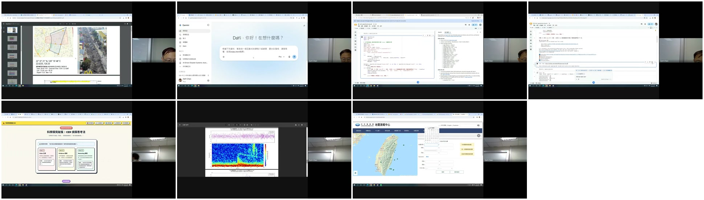

# 影片分析報告

來源：Google Drive 資料夾 `1ai4iZFgyjom4DQ92YTkJsEUEYp9vzYYw`  
錄影日期：2026-09-16、2026-09-23  
處理範圍：7 支 MP4（合計 3 小時 16 分 41 秒）與 1 份即時通訊紀錄

## 結論摘要

這批影片是臺灣大學層級的地球物理課程與專題討論，核心不是單純教軟體，而是把三條線串起來：

1. **地球物理問題**：板塊構造、地震目錄、2014 高雄氣爆與臺南安南區爆炸的地震／聲學訊號。
2. **研究方法**：以波形、到時、頻譜、三分量方向性及多測站資料，反推事件位置、時間與源特性。
3. **數位工作流**：GitHub、Google Colab、PyGMT、Gemini／AI Agent、GitHub Pages，以及地形模型的 3D 列印。

課程一再強調「AI 協助思考，不取代判斷」。影片中的最佳例子是氣爆研究：先由物理模型辨認 P 波、可能的 S 波與空氣聲波，再讓 AI 協助寫程式或整理資料，而不是直接要求 AI 判定答案。

## 各段錄影

| 檔案 | 長度 | 內容 |
|---|---:|---|
| F01（09/16） | 53:52 | 課程規劃、PyGMT 教材、高雄氣爆研究題目、GitHub 組織與專案設定 |
| F02（09/23） | 00:15 | 麥克風／錄音測試 |
| F03（09/23） | 18:18 | 作業一：Gemini 產生課程網頁、GitHub repository、GitHub Pages |
| F04（09/23） | 36:24 | 作業二上半：fork PyGMT 專案、Google Colab、全球板塊交界與剖面作業 |
| F05（09/23） | — | 即時通訊一則：確認「01 檔中的第二格」可成功執行 |
| F06（09/23） | 14:58 | 作業二下半：簡化 Colab 安裝／執行流程、提交方式與口頭報告安排 |
| F07（09/23） | 19:45 | 學生網頁報告、CER 與雙語學習、OpenTopography／STL／3D 列印 |
| F08（09/23） | 53:09 | 氣爆研究、地震活動機率預報、U-Net／Diffusion Model 專題討論 |

逐字稿在 [`transcripts/`](transcripts/)；`.md` 便於閱讀，`.srt` 可載入播放器。這些都是機器轉錄，並非逐句人工校訂。

## 重要內容

### 1. 2014 高雄氣爆與臺南爆炸

09/16 的課程先建立共同題目：

- 2014-07-31 高雄氣爆約在臺灣時間 23:56 發生；影片將它描述為沿地下管線延伸的「線狀源」，不是單一點源。
- 示範資料包含地表、井下、寬頻與強震儀器，並以約 2–8 Hz 濾波觀察爆炸訊號。
- 課堂辨認兩種主要傳播路徑：地下傳播的震波與空氣傳播的聲波／衝擊波。空氣波的表觀速度約 300–390 m/s，較晚抵達。
- 頻譜顯示事件初期有較高頻能量，隨時間衰減；多次爆炸可能使波形不是單一脈衝。

09/23 學生開始提出初步結果：

- 臺南安南區較新的爆炸案例有明顯空氣波，但地下 P 波似乎不如高雄案例清楚。
- 高雄案例可見較清楚的 P 波；部分分析嘗試找 S 波、聲波及三分量振幅差異。
- 老師要求下一步不要只「看到訊號」，而要從多測站到時與方向性反推：
  - 事件時間；
  - 水平位置與深度；
  - 波速與走時曲線；
  - 地上／地下爆炸的波形與頻譜差異；
  - 爆炸和地震的可辨識特徵。

這是整批影片最成熟的研究主線。合理的後續工作是把每個案例用同一套資料窗、濾波器、測站篩選與品質指標重做，再做走時反演和不確定度估計。

### 2. 地震活動機率預報

另一組題目使用中央氣象署地震目錄：

- 先計算相鄰事件的間隔時間；
- 檢查長時間無顯著地震後，較大事件的機率是否改變；
- 將模型輸出定位為「未來一段時間內的發生機率」，而不是宣稱能準確預言某時某地的地震；
- 後續可能加入 GNSS 形變訊號。

影片中「很久沒有大地震，因此接下來會有大地震」只是待驗證假說，不能當成已成立結論。嚴謹分析至少還需處理目錄完整度、規模門檻、餘震去群集、空間分區、樣本外驗證與機率校準；事件間隔也不應先假定服從常態分布。

### 3. U-Net／Diffusion Model 專題

學生比較三個模型版本，以 MAE 評估震度／地動預測。討論指出：

- 不同版本必須使用完全相同的訓練、驗證與測試資料，否則 MAE 不能公平比較。
- 部分歷史測站資料可能損壞或缺站，需先完成資料品質控制。
- 目前觀測輸入使用較粗略的震度，而模型公式使用 PGA；下一步應考慮直接使用 PGA，使輸入與目標物理量一致。
- 小規模事件數量增加可能改善結果，但也要排除資料量與切分方式造成的假進步。

### 4. 教學工作流

課程讓學生把 GitHub 當作雲端工作中心：

- Gemini 生成 `index.html`，上傳 repository 後以 GitHub Pages 發布；
- fork PyGMT 教材，在 Google Colab 安裝環境、執行 notebook、畫全球地形與地震分布；
- 選一個板塊邊界，繪製地震剖面並用 CER（Claim、Evidence、Reasoning）說明判斷；
- 由 OpenTopography 或 PyGMT 取得數值地形，轉成 STL，再用 Bambu Studio 準備 3D 列印。

影片也暴露實務問題：Colab 環境安裝時間長、路徑與 clone 步驟容易失敗。老師最後改成提供整理好的 notebook，降低環境設定負擔。若要讓作業可重現，建議固定依賴版本、提供一鍵檢查 cell，並把輸入資料與預期輸出範例放在 repository。

## 執行與品質

- ASR：`faster-whisper large-v3`，CPU int8
- 畫面索引：每 15 秒取樣，加上全片場景變化偵測
- OCR：繁中、簡中、英文
- 繁體中文：OpenCC `s2twp`
- 總畫面／OCR：1,438 張
- ASR 片段：3,022 段
- 自動標記低信心片段：435 段
- 7 支影片都完成下載、音訊抽取、全片掃描、OCR 與 ASR，沒有處理錯誤

09/16 後半段有多人交談和較多環境雜音，因此低信心標記特別多。專有名詞仍有誤辨，例如 PyGMT、GitHub、震央距、聲波／S 波等。詞彙後處理只修正高度確定的 `批波 → P波`、`正幅特別大 → 振幅特別大` 等字串；所有修正都記錄於 `*_normalisation-report.json`。

為避免誤導，`content_analysis_complete` 仍保持 `false`：本報告完成的是機器預處理、重點閱讀與抽樣視聽核對，不代表逐句逐幀人工認證。代表片段已另外組成 [`assets/recording_demo.mp4`](assets/recording_demo.mp4)，並核對到 Google Meet、Gemini、Colab/GitHub、CER、高雄氣爆聲譜圖與中央氣象署地震查詢畫面。

詳細處理統計與檔案雜湊在 [`run-manifest.json`](run-manifest.json)。
